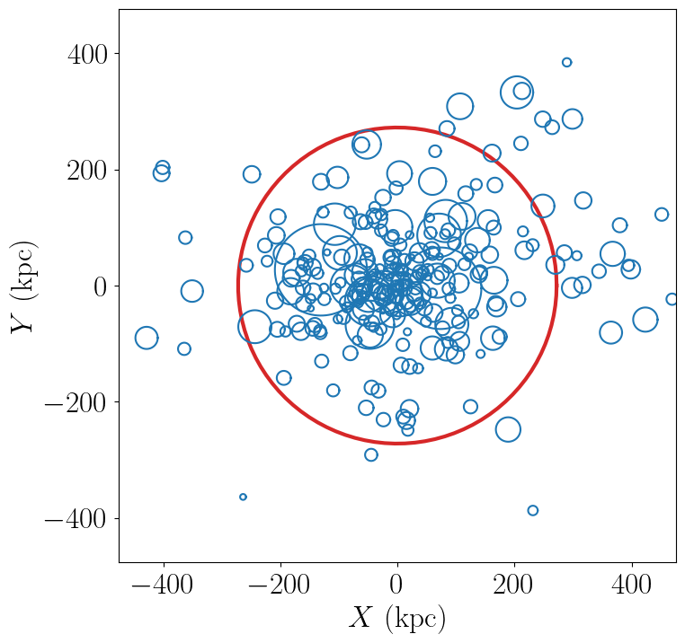
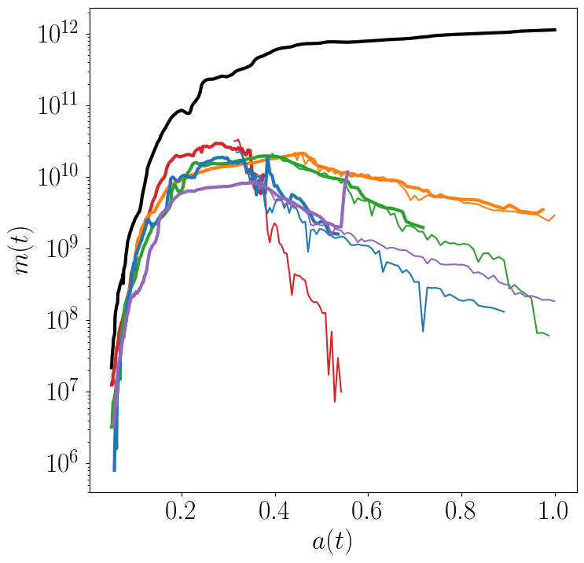
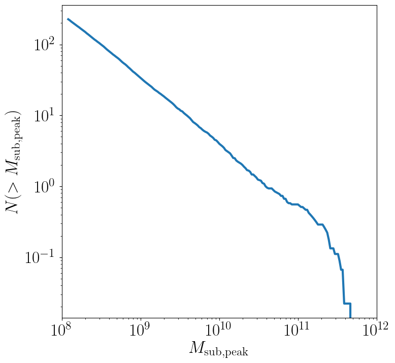
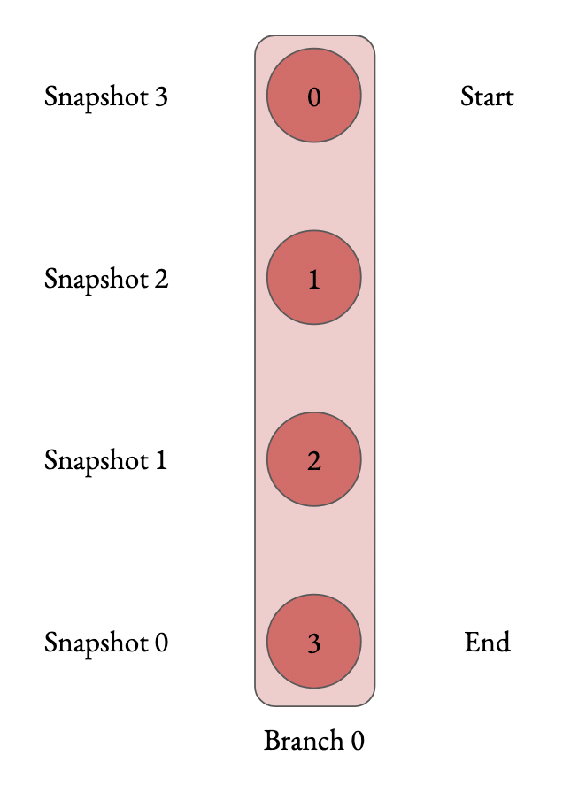
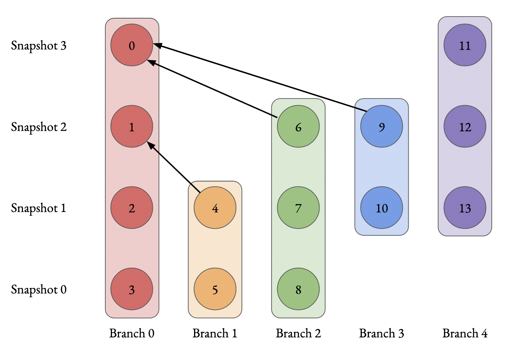
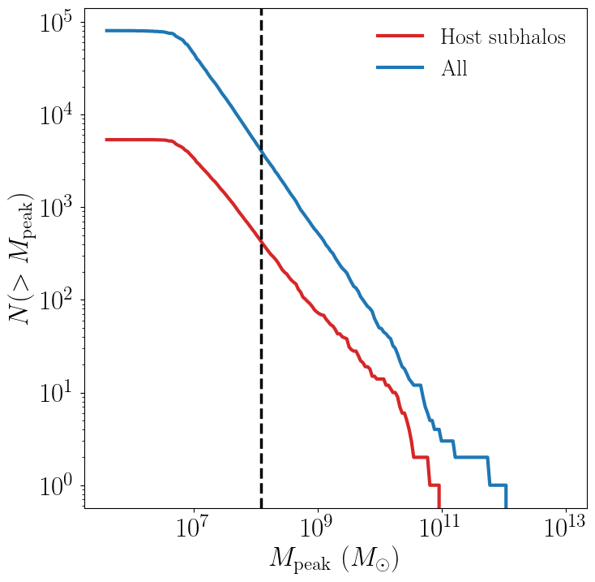

Getting Started
===============

Installation
------------

``symlib`` can be installed with pip. It depends on the standard scientific python libraries, `numpy <https://numpy.org/install/>`__, `scipy <https://scipy.org/install/>`__, and `matplotlib <https://matplotlib.org/stable/users/installing/index.html>`__. It also depends on the cosmology library `colossus <https://bdiemer.bitbucket.io/colossus/installation.html>`__. You can find installation instructions for all four libraries on their respective web pages.

.. code-block:: console

	$ pip install symlib

Currently, only Python3 is supported.
	
Downloading Data
----------------

Symphony data is organized into several suites of zoom-in simulations: the LMC, Milky Way, Group, L-Cluster, and Cluster suites. These suites respectively correspond to host halos with masses of 10^11, 10^12, 10^13, 5*10^14, and 10^15 Msun. The entire dataset is stored in a single base directory. Each suite has is its own sub-directory within the base, and each zoom-in simulation has a subdirectory within its suite. 

You can download data from

.. note::
   Finish writing once we know where data can be downloaded from.

Currently only halo data is available; please contact the developers about access to particle snapshots.

Reading in Subhalo Data
-----------------------

The first step to working with simulation data is loading the simulation
parameters. This is a dictionary containing cosmological and numerical
information. These can be looked up with :func:`symlib.simulation_parameters` by giving the directory of the halo as an argument.

.. code-block:: python

	import symlib

	sim_dir = "path/to/ExampleHalo"
	params = symlib.simulation_parameters(sim_dir)
	print(params)

.. code-block:: python
				
    {'flat': True, 'H0': 70.0, 'Om0': 0.286, 'Ob0': 0.049,
     'sigma8': 0.82, 'ns': 0.95, 'eps': 0.17, 'mp': 281981.0,
     'h100': 0.7}

The first six values are `colossus <https://bdiemer.bitbucket.io/colossus/>`__-compatible cosmological parameters, the next two are numerical parameters (``"eps"`` is the radius of each particle in comoving :math:`h^{-1}{\rm kpc}`, and ``mp`` is the mass of each particle in :math:`h^{-1}M_\odot`). The last value is :math:`h_{100} = H_0/(100\ {\rm km/s})`, which is often convenient to have.

Next, we read in the subhalos with the function :func:`symlib.read_subhalos`

.. code-block::

   halos, histories = symlib.read_subhalos(
       params, "path/to/HaloExample")

There are two return return values, ``halos`` and ``histories``. In your
code, you'll probably want to abbreviate these as ``h`` and ``hist``, or something similar, following the library code.

``halos`` is a 2D array that represents how the host halo and all its subhalos evolve over time. The first index accesses different halos and
second different times. It contains information like mass and
position. ``halos[0,235]`` is the host halo at snapshot
235, the last snapshot in the simulation. ``halos[3, 100]`` is the third
largest subhalo, including disrupted subhalos, at snapshot 100. Subhalos are ordered according to the largest mass they ever had, :math:`M_{\rm peak}`. Halos stay at the same index across their lifetimes.

``histories`` contains summary information about a halo's full history, including :math:`M_{\rm peak}` and when that subhalo fell into the host. Its length and ordering are the same as the first index of ``halos``. 

``halos`` is a numpy structured array has type :data:`symlib.SUBHALO_DTYPE`, and ``histories`` is a structured array with type :data:`symlib.HISTORY_DTYPE`. Structured arrays are arrays that have different fields which can be accessed with strings. For example, ``halos[3,100]["mvir"]`` and ``halos["mvir"][3,100]`` both return the mass, :math:`M_{\rm vir}` of the third most massive halo. The non-string indices obey normal numpy indexing rules, so you can use slicing, boolean indexing, axis removal and whatever other tricks you use with normal numpy arrays.

The full set of fields in ``halos`` is described in the :data:`symlib.SUBHALO_DTYPE` documentation. In this tutorial we will only use:

* ``"x"`` - Position
* ``"v"`` - Velocity
* ``"mvir"`` - Mass
* ``"rvir"`` - Radius
* ``"ok"`` - ``True`` if the halo exists at the given snapshot, ``False`` otherwise.

Fields in ``histories`` will be explained as needed, but can be found in full in the :data:`symlib.HISTORY_DTYPE` documentation.

Lastly, before we do any science, we need to handle units. The data used by ``symlib`` comes from a variety of sources, and needs to be converted into a standard set of units: physical kpc centered on the host halo for postions, km/s for velocities and :math:`M_\odot` for masses. This is done with the function :func:`symlib.set_units_halos` and :func:`symlib.set_units_histories`. This leads to a block of standard "boiler plate" code which will be in almost every ``symlib`` file.
   
.. code-block:: python

    sim_dir = "path/to/ExampleHalo"

    param = symlib.simulation_parameters(sim_dir)
    scale = symlib.scale_factors(sim_dir)

    halos, histories = symlib.read_subhalos(param, sim_dir)
    h = symlib.set_units_halos(h, scale, param)
    hist = symlib.set_units_histories(hist, scale, param)

The last new function here, :func:`symlib.scale_factors`, returns the scale factor, :math:`a(z)`, for each snapshot.
    
.. note::
   I hate having this much boiler plate code. Open to suggestions on making
   this better. Maybe I should make the unit conversions an optional argument that defaults to being true? (issue is that it's impossible to invert the conversion because it inovles centering, so you can't get the old units back). If I did it like that, the boiler plate code becomes

   ``sim_dir = path/to/ExampleHalo``
   
   ``param = symlib.simulation_parameters(sim_dir)``
   
   ``h, hist = symlib.read_subhalos(param, sim_dir)``

   which is much less painful. Im going to write the rest of the tutotial as if this is true, but would like some feedback on it before changing things. Keep that in mind if you're following along with the examples.

Example Subhalo Analysis: Subhalo Postions
------------------------------------------
   
Our first step with analyzing any simulation data should be to look at it
qualitatively. We'll start by looking at the positions of the major subhalos
around our central halo at the last snapshot of the simulation. We will plot the central halo in one color and the subhalos in another. We'll also need to skip all the subhalos that were destroyed before the end of the simulation.

We'll also use a utility function, :func:`symlib.plot_circle` to make the
circles.

.. code-block:: python

    import symlib
    import matplotlib.pyplot as plt
    fig, ax = plt.subplots()
    
    sim_dir = "path/to/ExampleHalo"
    param = symlib.simulation_parameters(sim_dir)
    halos, histories = symlib.read_subhalos(param, sim_dir)
    
    host = halos[0,-1] # First halo, last snapshot.
    symlib.plot_circle(ax, host["x"][0], host["x"][1],
                       host["rvir"], c="tab:red")
		       
    for i in range(1, len(h)):
        sub = halos[i,-1] # i-th halo, last snapshot.
        if not sub["ok"]: continue
        symlib.plot_circle(
            ax, sub["x"][0], sub["x"][1],
            sub["rvir"], c="tab:blue"
        )
    
With a little bit of additional pyplot work, this gives us the following. The full script used to create this image, including the omitted pyplot code is shown in `examples/positions.py <https://github.com/phil-mansfield/symphony/blob/main/examples/positions.py>`__.

From this, we can see that our host halo is surrounded by a swarm of subhalos. Bigger subhalos are rarer and generally closer to the center of the host. Some subhalos are outside the radius of the host. These "splashback subhalos" had been inside the host in the past but have temporarily orbited outside of it. They are included in the symlink catalogs by default.
	   
Let's review the concepts that went into creating this image:

* We read in simulation parameters and halo information with :func:`symlib.simulation_parameters` and :func:`symlib.read_subhalos`.
* We got the host halo at the last snapshot with ``halos[0,-1]`` and the subhalos with ``halos[i,-1]``.
* We got a vector representing the postion of the host by accessing ``host["x"]`` and the radius with ``host["rvir"]`` and were able to get similar quantities for subhalos.
* We needed to check ``sub["ok"]`` to make sure that the halo still existed at the snapshot we were interested in.

Here, the central halo at index 0 is red and all is subhalos are blue.
We used a built-in utility function called ``plot_circle`` and
needed to skip over some subhalos which disrupted before the final snapshot.

**Practice**

In the ``histories`` array, there is a field called ``merger_snap`` that gives the snapshot when a subhalo first fell into the host. Try coloring subhalos that fell in from the left side of the halo (:math:`x_{\rm infall} < 0`) differently from ones that fell in from the right. Do you notice anything different about where the two groups end up?

Example Analysis: Mass Growth
-----------------------------

Now, we'll try analysis that's a bit more quantitative. We'll look at the growth of subhalos over time. To do this, we'll need to get the scale factors, :math:`a(z)`, for each snapshot with :func:`symlib.scale_factors`. We'll also use one of the fields in ``histories``, ``"merger_snap"`` which is the snapshot when the subhalo first fell into the host. We'll use it to plot times before infall as dashed lines and times afterwards as solid lines.

.. code-block:: python
		
    sim_dir = "path/to/ExampleHalo"

    param = symlib.simulation_parameters(sim_dir)
    scale = symlib.scale_factors(sim_dir)
    h, hist = symlib.read_subhalos(param, sim_dir)

    snaps = np.arange(len(h[0])) # Snapshots #s, for making cuts.

    fig, ax = plt.subplots()
    colors = ["k", "tab:red", "tab:orange", "tab:green",
              "tab:blue", "tab:purple"]
    for i in range(6):
        ok = h[i,:]["ok"] # Snapshots where the halo exists
        if i == 0:
            # Plot the host halo
            plt.plot(scale[ok], h[i,ok]["mvir"], c=colors[i])
        else:
            # Plot the full history of the subhalo as a dahsed line
            plt.plot(scale[ok], h[i,ok]["mvir"], "--", c=colors[i])
            # Plot its history inside the host halo as a solid line
            is_sub = (snaps >= hist["merger_snap"][i]) & ok
            plt.plot(scale[is_sub], h[i,is_sub]["mvir"], c=colors[i])

With a little bit of additional pyplot work, this gives us the following. The full script used to create this image, including the omitted pyplot code is shown in `examples/mah.py <https://github.com/phil-mansfield/symphony/blob/main/examples/mah.py>`__.

Here we see that our subhalos spend most of their time in the simulation building up mass prior to falling in. The earlier-infalling halos shown here don't last for very long: they disrupt in a few snapshots! Others, like the green subhalo survive much longer.

Let's review the concepts that went into creating this image:

* We needed to read in scale factors with :func:`symlib.scale_factors` to figure out when each snapshot occured.
* We were able to figure out the snapshot when a subhalo fell into the host with ``histories``'s ``"merger_snap"`` field.
* The indices of structured arrays work just like normal numpy arrays, so we were able to select parts of them with the boolean arrays ``ok`` and ``is_sub``.

**Practice:**

You might have noticed that subhalos start losing mass before they actually start falling into the host (look at the green curve in particular). Using logic similar to the above plot, try figuring out how far away subhalos are on average from a host when they reach their peak mass.

Example Analysis: The Subhalo Mass Functions
--------------------------------------------

Lastly, let's try some more rigorous statistical analysis. We're going to measure the subhalo mass function of the entire Milky Way suite. We'll look at :math:`N(>M_{\rm peak})`, the average number of subhalos per host halo whose maximum mass was larger than :math:`M_{\rm peak}`. To do this, we'll need to access the ``"mpeak"`` field of the ``histories`` array.

More importantly, to get good statistics we'll need to loop over all the host halos in the Milky Way suite, ``SymphonyMilkyWay``. One way to do this would be to manually store the names of all the halo directories, but instead we'll use library functions to do it. First, we'll count the number of halos in the Milky Way-mass suite with :func:`symlib.n_hosts`. Then, we can get directory names :func:`symlib.get_host_directory`, which takes the base directory, suite name, and the index of the halo you want to read. Together this lets you loop over halo directories.

Constructing a mass function has a bit more code overhead than the earlier examples: the important part is how the loop over files works.

.. code-block:: python

    base_dir = "path/to/base/dir"
    suite_name = "SymphonyMilkyWay"
    param = symlib.simulation_parameters(suite_name)
    
    # Mass function bins and empty histogram.
    log_m_min, log_m_max, n_bin = 8, 12, 200
    bins = np.logspace(log_m_min), np.logspace(log_m_max)
    N_vir = np.zeros(n_bin)

    n_hosts = symlib.n_hosts(suite_name)
    for i_host in range(n_hosts):
        sim_dir = symlib.get_host_directory(base_dir, suite_name, i_host)
	h, hist = symlib.read_subhalos(param, sim_dir)

	# Only count objects within R_vir
        ok = h["ok"][:,-1] & (r < host_rvir)
        n_vir, _ = np.histogram(hist["mpeak"][ok][1:], bins=bins)

	# Add to the cumulative histogram.
	N_vir += np.cumsum(n_vir[::-1])[::-1]/n_hosts

    plt.plot(bins[:-1], N_vir, "k")

With a little bit of additional pyplot work, this gives us the following. The full script used to create this image, including the omitted pyplot code is shown in `examples/mass_func.py <https://github.com/phil-mansfield/symphony/blob/main/examples/mass_func.py>`__.

.. note::
   Need to regenerate this plot so it only has one curve.

Here, we can see the classic form of the subhalo mass function. At smaller subhalo masses, decreasing the subhalo mass by a increses the number of subhalos by roughly the same multiplicative factor, and there's a cutoff as the subhalos get close to the host mass.
   
Let's review the concepts that went into creating this image: 

* We needed to use :func:`symlib.n_hosts` to find the number of host halos in our target suite
* We needed to use :func:`symlib.get_host_directory` to find the names of the directories in the host halo.
* We needed the ``"mpeak"`` field of ``histories``
* We needed to do a little bit of array magic with numpy arrays, although this could also have been done in a less concise way.

**Practice:**

Try adding a curve for the mass function of surviving "splashback" subhalos to this plot.
  
Introduction to Merger Trees
----------------------------

For some analysis, the set of subhaloes described above won't be enough. In some cases you might want to know about the extended history of subhalos, including objects that merged with those subhalos before they fell into the host. You would need to use a merger tree.

A merger tree is an array that contains all the halos and subhalos in a simulation across all times. It also has additional structure and information which allows one to figure out which halos at an earlier snapshot evolve into which halos at a later snapshot. This includes "mergers," events that occur when subhalos disrupt and contribute most of their mass to a larger host. This is a bit of a different definition than what we qualitatively think of as a merger: tree-mergers can happen many orbits after a subhalo falls into a host.

The merger trees in Symphony (generated with the merger tree code `consistent-trees <https://bitbucket.org/pbehroozi/consistent-trees>`__) are 1D arrays. These arrays are made of of separate sequences called "branches." A branch contains a single halo as it evolves over time. In Symphony's trees, halos in a branch are stored together, starting with the the halo's *last* and ending with the *first*. Every snapshot between the first and the last is included. Below is an example of the merger tree in a simulation with four snapshots, which has one halo that survived through all of these snapshots. The numbers in each circle show the index of that halo's data in the array.

	     
Real simulations will have many halos, and these halos might not exist at all snapshots. When one halo's branch ends, the next halo's branch will begin at the next element. The image below shows an example of what a simulation with several halos might look like.
	     
.. image:: tree_2.png
    :height: 400

The tree also contains information on what happens to a halo after it disrupts. Some halos that disappear do so because they were orbiting a larger halo and were shredded apart. In these cases, the merger tree marks the event as a merger. The arrows below show an example set of mergers.
	     

Note that more than one merger can occur within a halo in a single snapshot. This image also illustrates the ordering of branches within the tree ("depth-first ordering").

Merger information is stored in the tree the snapshot before the merger occurs. Each halo keeps track of its "co-progenitor", the last halo in the next branch that merges in that snapshot. It's easiest to understand visually:
	     
.. image:: tree_4.png
    :height: 400

In practice, this means that finding all the mergers for a host halo invovles hopping around from halo to halo.

Mergr tree analysis is an advanced technique and may not be necessary for many users. If one is only interested in resolved substructure of the host halo, virtually everything can be done with the subhalo arrays above. The tree essentially only allows one to analyze subresolution subhalos and objects far away from the host halo. Both tasks must be done with caution.

Using Merger Trees with Symlib
------------------------------

Full merger trees are more computationally intense than subhalo catalogs, meaning that they are a little more complicated to use than the host's subhalos. Instead of using structured arrays, individual variables are read from disk as 1D arrays that have the tree's ordering. This allows you to only load variables you need. Additionally, snapshots where a halo does not exist are not included in the tree. This makes indexing more complicated, but saves memory.

One last caveat is that tree variables are stored in consistent-trees's native units. These are inhomogenous and are listed in the full ``symlib`` documentation page.

As a first example, we'll do some analysis that doesn't care about the connections between different branches. We'll calculate :math:`M_{\rm peak}` (the maximum :math:`M_{\rm vir}` that the halo ever had). Because tree reading is a more advanced and less useful procedure than reading the host's subhalo information, this will be done purely by example. The full symlib documentation contains more detailed information on tree-reading and tree-manipulating functions.

Omitting some standard preamble and most of the plotting code, the following code block will:

* Read mass data in from the tree
* Loop over branches and calculate :math:`M_{\rm peak}`
* Split those branches into "real" branches and branches that are probably artifacts.
* Create mass functions for those groups

.. code-block:: python

    # Read in tree data
    b = symlib.read_branches(sim_dir)
    # Tree variables are always returned as a list, so if you
    # only specify one, unpack it as a length-1 tuple.
    mvir, = symlib.read_tree(sim_dir, ["mvir"])
    # Convert units
    mvir, mp = mvir/param["h100"], param["mp"]/param["h100"]

    # Flag halo branches which are probably not artifacts.
    ok = b["is_real"] & (~b["is_disappear"])

    mpeak = np.zeros(len(b))

    # Loop over all branches and calculate M_peak.
    for i in range(len(mpeak)):
        if not ok[i]: continue
        start, end = b[i]["start"], b[i]["end"]
        mpeak[i] = np.max(mvir[start: end])
    
    # Find host subhalos
    mpeak_host = mpeak[b["is_main_sub"]]

    # Calculate the mass function of both groups of halos
    bins = np.logspace(np.log10(param["mp"]/param["h100"]), 13, 200)
    n_host, _ = np.histogram(mpeak_host, bins=bins)
    n_all, _ = np.histogram(mpeak, bins=bins)
    N_host = np.cumsum(n_host[::-1])[::-1]
    N_all = np.cumsum(n_all[::-1])[::-1]

    # Plot
    fig, ax = plt.subplots()
    left_bins = bins[:-1]
    plt.plot(left_bins, N_host, c="tab:red", label=r"${\rm Host\ subhalos}$")
    plt.plot(left_bins, N_all, c="tab:blue", label=r"${\rm All}$")

This results in the following plot
    

The dashed vertical line has been added to show a rough resolution limit, 300 particles. As this plot shows, most of the contents of the tree file are outside the target host halo and most of the corresponding objects are poorly resolved. The objects returned by :func:`symlib.read_subhalos` only consist of the red curve down to the black dashed line.

As a second example, we will navigate through the merger tree to find the number of mergers in each snapshot. These will be split into real mergers and artifacts. The latter includes a few criteria, but mostly it's objects whose first snapshots occured already inside the host halo. The time resolution of these simulations is high enough that any instances where this happens are either statistical noise or a halo which the merger tree had previously lost track of (i.e. a halo that merges twice). These objects have already been removed in the standard subhalo arrays.

This code will do the following:

 * Read in tree data, including snapshot and connectivity information.
 * Create a merger lookup table
 * Loop through the host's branch and use the lookup table to find the mergers in each snapshot.
 * Classify those mergers based on whether or not they are artifacts.
 * Convert snapshot information into cosmological times.

As before, some plotting code and standard setup code that reads in parameters and subhalo information has been omitted.

.. code-block:: python

    # Read in tree data
    b = symlib.read_branches(sim_dir)
    dfid, next_co_prog, snap = symlib.read_tree(
        sim_dir, ["dfid", "next_co_prog", "snap"]
    )

    host_branch = b[hist["branch_idx"][0]]
    host_start = host_branch["start"]
    host_end = host_branch["end"]
    
    # Flag halo branches which are probably not artifacts.
    ok = b["is_real"] & (~b["is_disappear"])
    
    # Counting the number of mergers. Requires a lookup
    # table, which we construct from the branch
    # information and the depth-first IDs ("dfid")
    table = symlib.merger_lookup_table(b, dfid)
    n_mergers = np.zeros(host_end - host_start, dtype=int)
    n_artifacts = np.zeros(host_end - host_start, dtype=int)
    for i in range(host_start, host_end):
        branch_idx = symlib.find_all_merger_branches(
            b, table, next_co_prog, i)
        n_mergers[i - host_start] = np.sum(ok[branch_idx])
        n_artifacts[i - host_start] = np.sum(~ok[branch_idx])

    # Getting the scale factor of each snapshot.
    host_snap = snap[host_start: host_end]
    host_scale = scale[host_snap]

    # Plot
    fig, ax = plt.subplots()
    ax.plot(host_scale, n_mergers, "tab:blue",
            label=r"$N_{\rm merger}$")
    ax.plot(host_scale, n_artifacts, "tab
		
		
		
.. image:: tree_mergers.png
   :width: 500
	    
