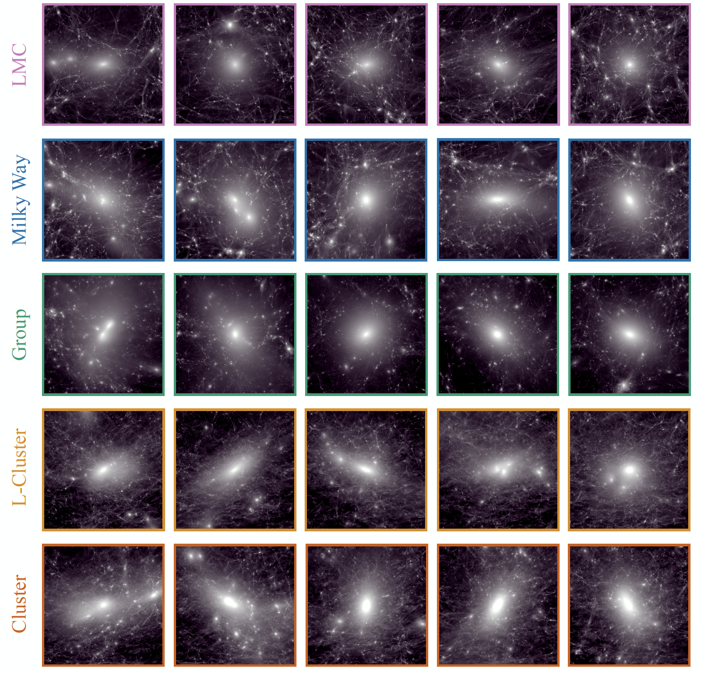

The Symphony Simulation Suite
=============================

The Symphony simulation suite is a publicly-accessible collection of 262 simulated dark matter halos, the massive dark matter structures that all galaxies grow within. These halos span a wide range of sizes: the smallest would be home to dwarf galaxies similar to the Large Magellanic Cloud, while the largest would be host massive galaxy clusters, containing hundreds of Milky Way-like galaxies.

This website contains information on these :doc:`simulations <simulations>`, :doc:`the people who ran them <credits_acknowledgements>`, :doc:`how to access the data <data_access>`, and :doc:`how to interact with the data <getting_started>`. For experienced users, we have a :doc:`quickstart <quickstart>` page that will allow you to start you analysis as soon as possible. For students, we also have a page containing :doc:`lecture notes, slides, and review papers <background_reading>` that might be helpful to understand the jargon and concepts involved with analyzing these types of simulations.

Full Table of Contents
----------------------

.. toctree::

   simulations
   credits_acknowledgements
   quickstart
   data_access
   working_with_subhalos
   working_with_particles
   working_with_trees
   symlib_documentation
   background_reading
