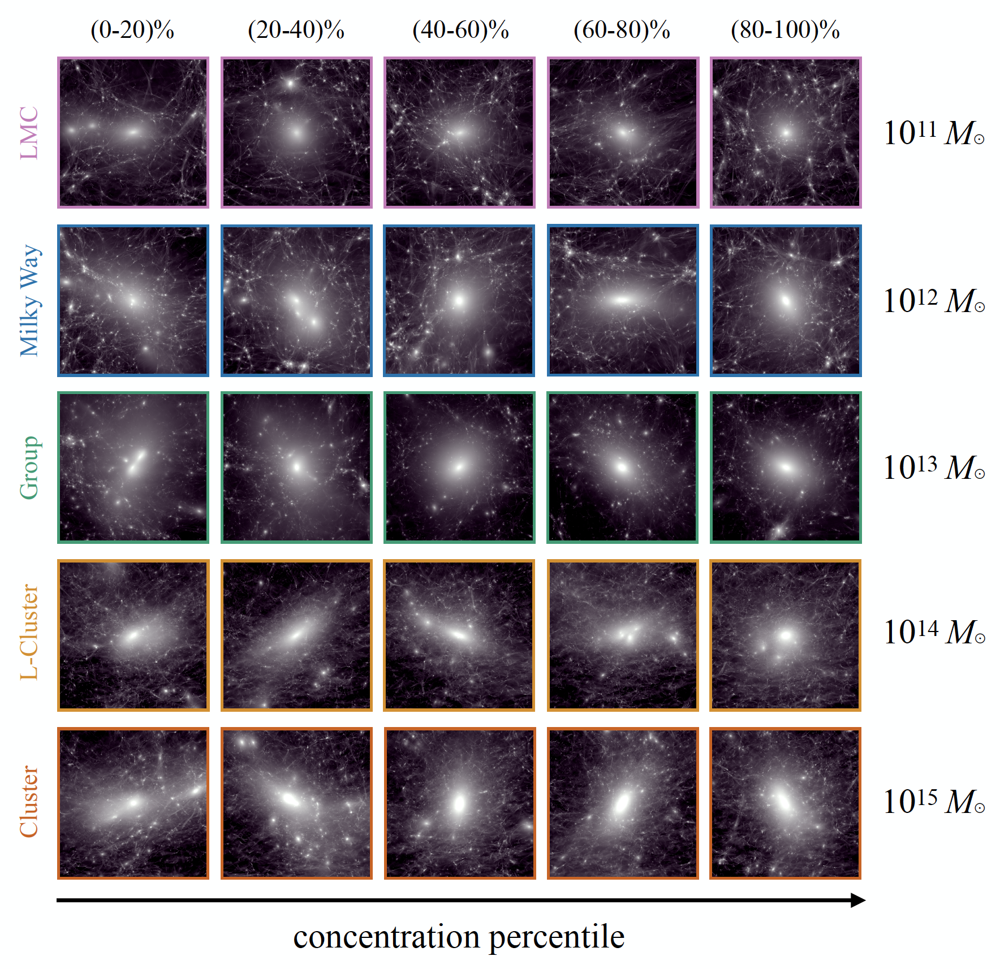

Simulations
===========

About the Simulations
---------------------

Symphony is a compilation of 262 cosmological, cold dark matter-only zoom-in simulations spanning four decades of host halo mass, from :math:`10^{11}\,M_\odot` to :math:`10^{15}\,M_\odot`. In particular, Symphony includes zoom-in simulations of 39 Large Magellanic Cloud-mass host halos (:math:`10^{11}\,M_\odot`), 45 Milky Way-mass host halos (:math:`10^{12}\,M_\odot`), 49 strong lens-analog Group host halos (:math:`10^{13}\,M_\odot`), 33 Low-mass Cluster host halos (:math:`4\times 10^{14}\,M_\odot`), and 96 Cluster host halos (:math:`10^{15}\,M_\odot`).

Each simulation is run at high resolution relative to the corresponding host halo mass scale, such that hosts are typically composed of several million dark matter particles [particle sizes range from :math:`5\times 10^{4}\,M_\odot` to :math:`1.8\times 10^{8}\,M_\odot`]. Symphony’s large statistical host halo sample— spanning several orders of magnitude in host halo mass—combined with its high resolution, enables measurements of host halo and subhalo population properties over a wide dynamic range. Furthermore, a unified set of analysis tools was used to process these simulations, and the documentation provided in this library allows simulation data to be accessed with ease across the suites.

The image below shows five host halos from each Symphony suite. Each row corresponds to a different suite, from the lowest-mass (LMC) hosts at the top to the highest-mass (Cluster) hosts at the bottom. Host halo concentration—a number which increases as more of its mass is concentrated in the halo center—increases in quintiles from left to right, such that hosts with the more centrally concentrated dark matter distributions within each suite are shown towards the right. Visualizations were created using the phase-space tessellation method described in `Kaehler et al 2017 <https://linkinghub.elsevier.com/retrieve/pii/S2213133716301536>`_, `2018 <https://library.imaging.org/ei/articles/30/1/art00005>`_.
	

Technical Details
-----------------

Please refer to E. O. Nadler et al. (2022, in preparation) for complete technical details regarding the five Symphony simulation suites, including the simulations' numerical and cosmological parameters, convergence properties, host and subhalo population properties, and so on. The table below summarizes the relevant properties of each simulation suite. Note that the Milky Way, L-Cluster, and Cluster suites were originally presented in `Mao et al 2015 <https://iopscience.iop.org/article/10.1088/0004-637X/810/1/21>`_, `Bhattacharyya et al 2022 <https://iopscience.iop.org/article/10.3847/1538-4357/ac68e9>`_, and `Wu et al 2013a <https://iopscience.iop.org/article/10.1088/0004-637X/763/2/70>`_, `2013b <https://iopscience.iop.org/article/10.1088/0004-637X/767/1/23>`_, respectively. In addition to citing E. O. Nadler et al. (2022, in preparation), studies that use any of these suites should also cite these original papers.

.. image:: symphony_table.png
   :width: 1000

Publications
------------

* **SYMPHONY: Cosmological Zoom-in Simulation Suites over Four Decades of Host Halo Mass** --- *E. O. Nadler et al. (in preparation)* --- This paper presents the Symphony compilation and studies the corresponding host and subhalo population properties, comparisons between Symphony simulations and semi-analytic structure formation predictions, galaxy--halo connection modeling using Symphony, and Symphony simulations' convergence properties.
