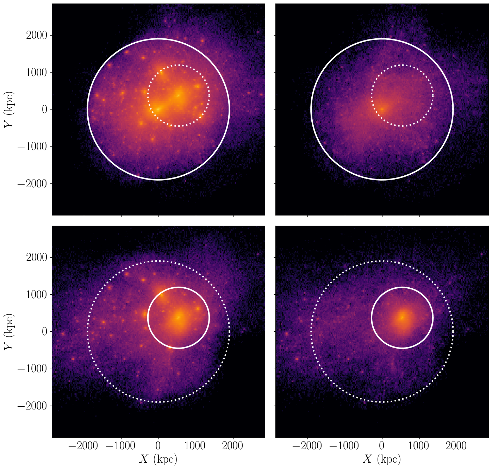
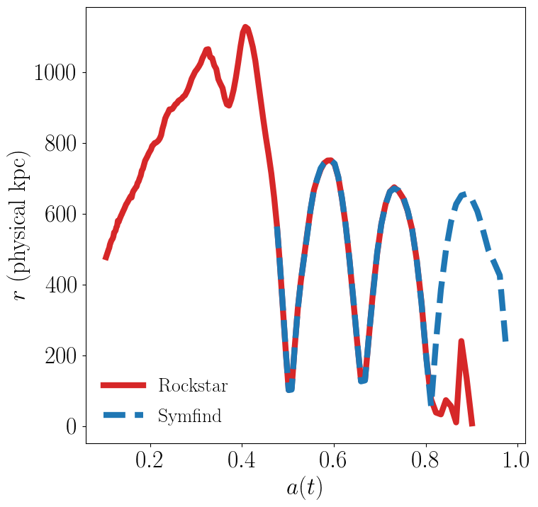
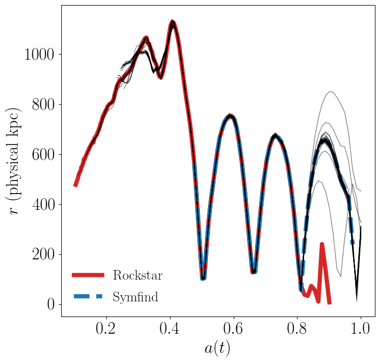

Particle Tutorial
=================

Symphony gives you access to all particles associated with the host halo and its subhalos, as well as the trajectories of those particles over time. This page contains tutorials and example code showing how to use these particles through ``symlib``. A complete, detailed reference for the library can be found :doc:`here <symlib_documentation>`.

Suggested Downloads
-------------------

For the purposes of this tutorial, we recommend working with the least space-intensive halo in the Symphony suite, ``Halo_042`` in ``SymphonyLCluster``. See the :doc:`Data Access <data_access>` page for instructions on downloading its particle data. Because of the size of the dataset, we recommend using the ``rclone`` method described on that page.

Reading in Particle Data
------------------------

To read in particle data, you must first create a ``symlib.Particles`` object using that halo's simulation directory, then calling the ``read`` method for each snapshot that you would like to read.

.. code-block:: python

	import symlib

	sim_dir = symlib.get_host_directory(
        "my/halo/dir", "SymphonyLCluster", "Halo_042")

	# Read header data needed to fast particle reads
	part = symlib.Particles(sim_dir)

	# Read particle data for snapshot 199
	p = part.read(199)

By default, ``read`` will return a list with particle data for the host and
each of its subhalos. The ordering is the same as the results of ``symlib.read_rockstar`` and ``symlib.read_symfind``: the host is the first element, and the rest of the elements are its subhalos, sorted by :math:`M_{\rm peak}`. Each element of the returned list will be be a structured numpy array of type ``symlib.PARTICLE_DTYPE`` containing all the particles which have ever been accreted onto the subhalo, excluding particles which had previously been accreted by a larger halo. The following code shows how to access the different fields of the largest subhalo's particles.

.. code-block:: python

	# Important properties
				
	# Particle positions relative to the host in physical kpc
	x = p[1]["x"]
	# Particle velocities relative to the host in km/s
	v = p[1]["v"]
	# Boolean indicating whether this particle is currently
	# being tracked (always true with default settings)
	ok = p[1]["ok"]

	# Niche properties that most users won't need.
	
	# Snapshot when this particle was first accreted onto any
	# halo.
	snap = p[1]["snap"]
	# True if the particle was smoothly accreted onto this subhalo
	# and false if it accreted onto a smaller object first.
	smooth = p[1]["smooth"]
	# The original IDs of the particles in the raw Gadget-2 snapshots
	id = p[1]["id"]

As reminder for those of you unfamiliar with how structured arrays work, in this case they are arrays which contain a combination of scalars and vectors. For scalars, you access a value with ``p[subhalo_index][variable_name][particle_index]`` and for vectors you access a value with ``p[subhalo_index][variable_name][particle_index,dimension]``. Both ``particle_index`` and ``dimension`` can be set to ``:`` to return a full array instead of a single value. Both can also be set to "filter" arrays to return a subset of elements: either boolean arrays which select which elements are included in the returned array or integer arrays that specify the indices and order of elements to be returned.
	
The following example code will plot the density distribution of the host's particles and of its largest subhalo. The same will also be plotted using only the smoothly accreted component. As always, I've omitted most of the pyplot boilerplate code that gets used to make the plot look pretty, and I've also omitted the code that plots the locations and radii of the host and is subhalo for brevity. You can find the full file in the symlib github repo at ``examples/particle_hist.py``.
	
.. code-block:: python

    import matplotlib.pyplot as plt
    import symlib
    import matplotlib as mpl

    sim_dir = symlib.get_host_directory(
        "my/base/dir", "SymphonyLCluster", "Halo_042")

    fig, ax = plt.subplots(2, 2)

    part = symlib.Particles(sim_dir)
    p = part.read(199)

    # Plot parameters
    norm = mpl.colors.LogNorm(vmin=1, vmax=10000)
    lim = 3000
    kwargs = {"extent": [-lim, lim, -lim, lim],
              "norm": norm, "cmap": "inferno", "gridsize": 200}

    # Plot the host's particles
    ax[0,0].hexbin(p[0]["x"][:,0], p[0]["x"][:,1], **kwargs)

    # Plot the biggest subhalo's particles
    ax[1,0].hexbin(p[1]["x"][:,0], p[1]["x"][:,1], **kwargs)

    # Plot smoothly accreted particles of the host
    is_smooth = p[0]["smooth"]
    ax[0,1].hexbin(p[0]["x"][is_smooth,0],
                   p[0]["x"][is_smooth,1], **kwargs)
				   
    # Plot smoothly accreted particles of the biggest subhalo.
    is_smooth = p[1]["smooth"]
    ax[1,1].hexbin(p[1]["x"][is_smooth,0],
                   p[1]["x"][is_smooth,1], **kwargs)

The particles associated wiht the host halo are shown in the top left corner, and the particles associated with the biggest subhalo are shown in the bottom left. The right column shows the same, but restricted to particles which smoothly accreted on both object (i.e. particles which are only associated with that object).

Note that a particle is includedwith all the objects that it's associated with, so 
			 
Particle I/O Modes
------------------

Particles can be read in three different modes, which are specified by a string argument to the ``mode`` parameter of the ``read`` method. The default mode is ``"current"``, meaning that all particles which have been accreted onto a subhalo at or before the current snapshot are included, even if those particles are also associated with a smaller subhalo orbiting the object of interest. If you are analyzing particles at a single snapshot, you'll almost certianly want to use this mode.

The next mode you may be interested in using is ``"all"``. This includes all particles, including ones that haven't been accreted by the snapshot of infall. These particles aren't explicitly tracked. This means that the positions and velocities will be set to zero and the ``"ok"`` field will be set to ``False``. The reason ``"all"`` mode is helpful is because a particle *is at the same index across all snapshots*, meaning that it's easier to follow the trajecotry of a particle over time. (We'll walk through how to do this in the next code example.)

Lastly, particles can be read in ``"smooth"`` mode, which only reads in particles which were smoothly accreted onto a given subhalo. Particles in this mode are also included prior to accretion, just like ``"all"``. There are some niche applications to smoothly accreted particles, but for most users there are two reasons you might be interested in this mode. The first is that particles in the other modes can belong to more than one subhalo. For example, if a particle fell into subhalo 10, then subhalo 10 got accreted onto subhalo 1, then subhalo 1 fell into the host, this particle would appear in ``p[10]``, ``p[1]``, and ``p[0]``. In the ``"smooth"`` mode, each particle appears in exactly one subhalo's particle array. The second benefit is I/O performance, which we'll discuss in a later section.

Particle Trajectories
---------------------

In this example, we will used one of the fixed-size particle modes to plot particle trajectories. We'll also use another method of the ``Particles`` class, ``core_indices``, which identifies the 32 most-bound "core" particles of the halo at the time of infall. These generally stay in the center of the subhalo. Many galaxy models assume that a galaxy follows the position/velocity of the most bound particle after the subhalo disrupts. This is called an "orphan" model.

For this example, we'll investigate subhalo ``15`` of ``Host_042`` in the ``SymphonyLCluster`` suite. Rockstar and Symfind measure different behaviour for this subhalo:

Which subhalo finder is right in this case? Let's look at the trajectories of this subhalo's core particles to find out.

.. code-block::

    sim_dir = symlib.get_host_directory(
        "/sdf/home/p/phil1/ZoomIns", "SymphonyLCluster", "Halo_042")
    i_sub = 15

    part = symlib.Particles(sim_dir)

    # Read in core particles. mode chooses what I/O mode the cores
    # are indexed relative to and halo only causes a single subhalo
    # to be read.
    cores = part.core_indices(mode="smooth", halo=i_sub)

    # Radii of core particles over the 200 snapshots of the sim.
    r = np.zeros((200, 32))
    # Whether the particle is tracked in this snapshot.
    ok = np.zeros((200, 32), dtype=bool)
    # Scale factors
    scale = symlib.scale_factors(sim_dir)
	
    # Place radii and ok flags into 2D arrays.
    def radius(x): return np.sqrt(np.sum(x**2, axis=1))
    for snap in range(200):
        p = part.read(snap, mode="smooth", halo=i_sub)
		x[snap] = radius(p["x"][cores])
        ok[snap] = p["ok"][cores]

    # Plots particle trajectories
    for i in range(32):
        ok_i = ok[:,i]
        ax.plot(scale[ok_i], r(x[ok_i,i]), lw=1, c="k", alpha=0.5)

As always, some additional plotting code (in this case, all the plotting code that handles the subhalo radii) has been omitted for brevity. You can find the full version of this script in ``examples/trajectory.py``.
			 
Assorted Notes on I/O Performance
---------------------------------

The call to ``symlib.Particles`` does quite a bit of reading and pre-computing. It also holds onto a fairly large amount of RAM (although smaller than a single full snapshot). Because of this, be careful about how you loop over snapshots:

.. code-block:: python

	# Slow
	for snap in range(n_snap):
	    part = symlib.Particles(sim_dir)
		p = part.read(snap)

	# Fast
	part = symlib.Particles(sim_dir)
	for snap in range(n_snap):
	    p = part.read(snap)

To save space, particles that appear in multiple subhalos are only stored once, with the halo that they were smoothly accreted onto. This means that reading particles in ``"smooth"`` mode is faster than reading them in ``"all"`` or ``"current"`` mode. Additionally, the entire snapshot must be read in to read particles in ``"all"`` or ``"current"`` mode. This is not a problem if you want the entire snapshot anyway, but if you just want to look a single halo over time, as we did in the previous example, this can be much slower than it needs to be. In constrast, ``"smooth"`` mode can read a single halo very quickly. You can specify that you want a single halo with the ``halo`` argument to read.

.. code-block:: python

	# Slow
	part = symlib.Particles(sim_dir)
	for snap in range(n_snap):
	    p = part.read(snap, mode="current", halo=target_index)
	
	# Fast
	part = symlib.Particles(sim_dir)
	for snap in range(n_snap):
	    p = part.read(snap, mode="smooth", halo=target_index)

Of course, these different modes read in different sets of particles, meaning that usually you aren't free to switch one out for the other, but this can be convenient when, e.g., you want to quickly debug trajectory code.
	
Particles are stored relatively space-efficiently on disk. A simple compression algorithm is used to store positions and velocities with half the typical number of bytes and repeat information like partile IDs and infall snapshots is only stored once. No particle information is stored prior to infall. This means that despite the additional metadata the Symphony stores, its particles take up roughly a fifth the space that it would take to store the corresponding raw particles.

Raw Particle Snapshots
----------------------

We also make several full Gadget-2 snapshots available for each halo in the ``full_snapshots`` dataset.

These files correspond to :math:`z=0,\,0.5,\,1,\,2,\,4`. The files are stored as ``{suite name}/{halo name}/full_snapshots/snapshot_{snapshot number}.{file number}``. For the LMC, MilkyWay, and Group suites, the snapshot numbers are ``109``, ``149``, ``181``, ``203``, and ``235``. For LCluster and Cluster, the snapshots are ``075``, ``115``, ``146``, ``168``, and ``199``. Later snapshots corresponds to smaller redshifts. Each snapshots is split into multiple zero-indexed files: the halos in the LMC, MilkyWay, and Group suites are broken into eight files, the halos in the LCluster suite are split into sixteen files, and the halos in the Cluster suite are split into four files.

We don't officially provide support for Gadget-2 files in the symlib library, but I have an external lightweight Gadget-2-reading library you can use that you can use for reading these files in `Python <https://github.com/phil-mansfield/read_gadget/blob/main/read_gadget.py#L273>`_ and `Go <https://github.com/phil-mansfield/read_gadget/blob/main/read_gadget.go#L27>`_, and there are no shortage of other external libraries that will also work, like LensTools and yt. If you use my library to read these files, the correct list of fields is ``["x", "v", "id32"]``.

If you are using another library or your own code to read these snapshots, the following information may be useful, since Gadget-2 is not a context-free file format:

- The files contain three blocks: positions, velocities, and IDs
- The position and velocity blocks use 4-byte floats, and the ID blocks use 4-byte ints.
- The high-resolution particles are stored as type 1 particles, and lower resolution particles are stored as successively higher particle types
- Positions are stored in comoving :math:`h^{-1}{\rm Mpc}`, particle masses are stored in units of :math:`10^{10}\,h^{-1}M_\odot`, and velocities are stored in Gadget-2's internal code units. *This means you need to multiply the velocities by* :math:`a^{1/2}` *if your library doesn't do it for you*. After this, the velocities will be in units of :math:`{\rm km\,s^{-1}}`.
- These are Gadget-2 snapshots, *not* LGadget-2 or uberLGadget-2 snapshots. The latter formats are sometimes used for large cosmological simulations, and not all Gadget-2-reading libraries can read all three types.
